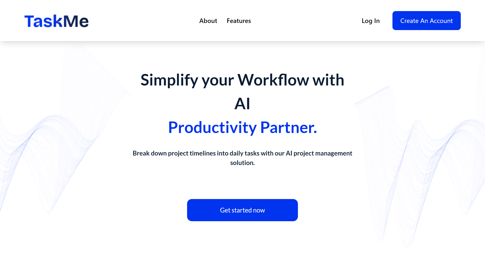
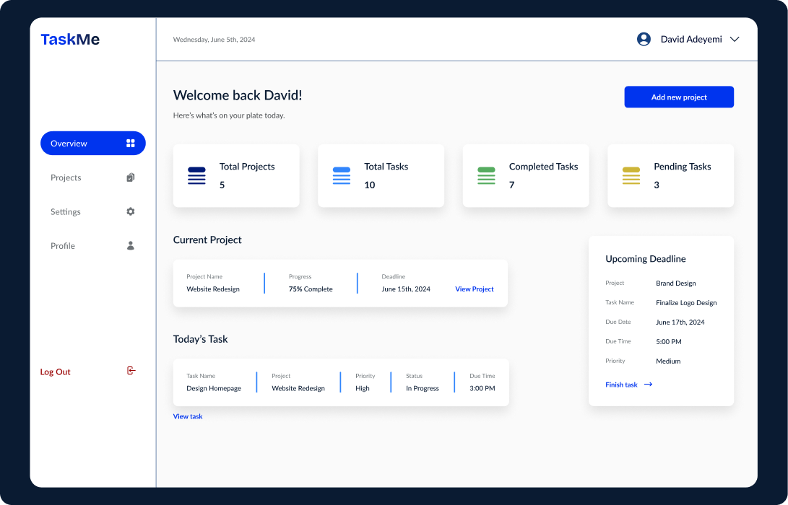

# TaskMe AI - Simplify Your Workflow with AI Productivity Partner


Welcome to TaskMe AI, your AI-driven project management solution designed to simplify your workflow and enhance productivity. Created for the PipeOps 1.0 Hackathon, TaskMe AI helps you break down project timelines into manageable daily tasks, ensuring you stay on track and meet your deadlines with ease.

## Features

### Task Breakdown
- **Input your project:** Enter your project details, including timeline and key milestones.
- **Get daily tasks:** TaskMe AI will break down your project into manageable daily tasks, making progress effortless.

### Project Tracking
- **Track your progress:** Monitor your progress daily, adjust tasks as needed, and stay on top of your deadlines.

### User-Friendly Interface
- **Intuitive design:** Enjoy an intuitive and user-friendly interface designed for maximum efficiency.

## How It Works

1. **Input Your Project**
   - Enter the details of your project, including the timeline and the key milestones.

2. **Get Daily Tasks**
   - TaskMe will break down your project into manageable daily tasks, ensuring consistent progress.

3. **Track Your Progress**
   - Monitor your progress, adjust tasks as needed, and stay on top of your deadlines.

## Mission and Values

TaskMe AI was born out of the collective frustration of a group of passionate individuals who felt overwhelmed by the complexity of existing task management tools. We believe there had to be a better way—a simpler, more intuitive solution to help individuals stay organized, productive, and focused on what matters most.

We’re not just another task management tool; we’re your trusted partner in productivity. Our approach is simple yet powerful: we combine cutting-edge technology with intuitive design to create a seamless task management experience. With TaskMe, you can break down projects into manageable tasks and track your progress in real-time.

### Our Mission
To empower individuals to achieve their goals with ease and efficiency.

### Our Values
- **Transparency:** Clear and open communication at all times.
- **Simplicity:** Making task management straightforward and stress-free.
- **User-Centricity:** Focusing on the needs and experiences of our users.

## Technologies Used
- **React** and **Tailwind** for user interfaces
- **Figma** for design
- **Vercel** for deployment

## Getting Started

To get started with TaskMe AI, simply clone the repository and follow the setup instructions:

```bash
git clone https://github.com/oreoluwa212/taskMe-AI
cd taskMe-AI
npm install
npm run dev
